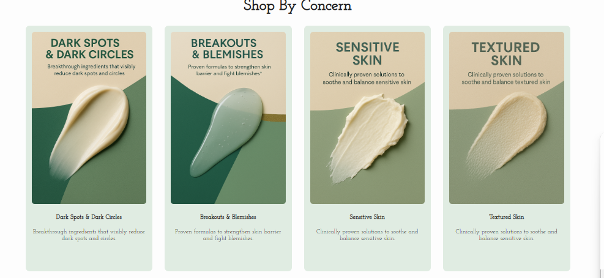
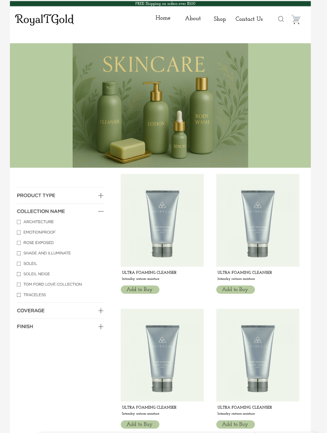
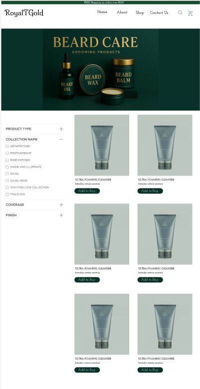
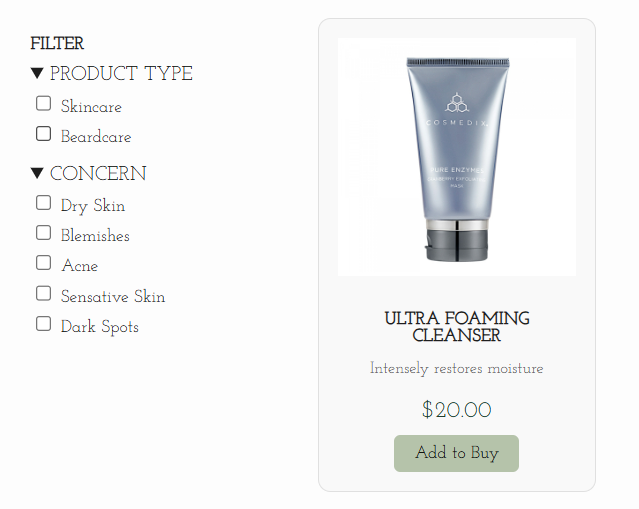
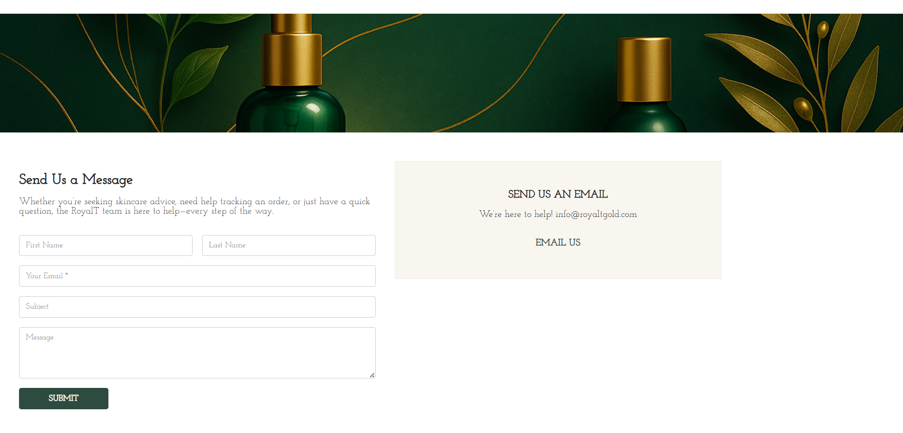
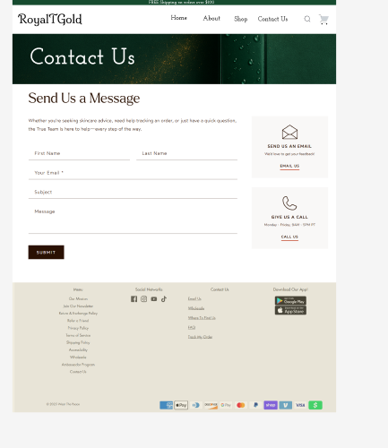
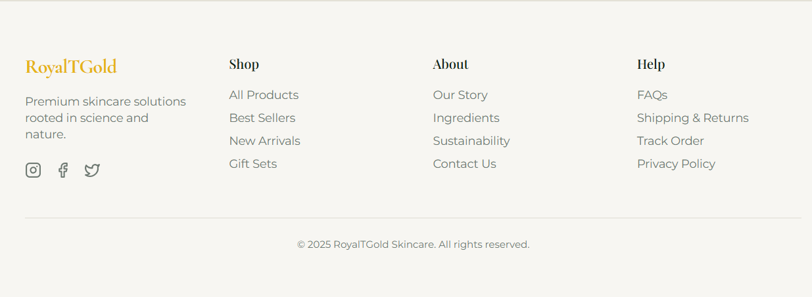

# E-Commerce Website | Summer Internship Project

**3.5-month software development internship · Visual project showcase · Source code private under NDA**

> **Project status:** Substantially developed, but not fully completed or publicly launched. This repository documents work from my summer internship using sanitized visual mockups rather than proprietary source code.

## Overview

During a 3.5-month summer internship at a startup, I worked on an e-commerce website focused on skincare and personal-care shopping. The project included storefront layouts, product discovery, category browsing, filtering interfaces, and customer-facing pages.

By the end of my internship, the website was close to completion, with some work still remaining. The startup did not proceed with a public launch due to internal company circumstances. Although the application was never released, the development experience and work completed during my internship were real.

This repository is a **visual portfolio of that work**, not a runnable copy of the company's application.

## Interface Showcase

The following images are sanitized mockups of the website's interface. Original product imagery and other sensitive assets have been replaced for portfolio presentation.

### Homepage and Featured Content

The homepage concepts bring together product highlights, shopping-by-concern navigation, promotional sections, and email signup.

### Best Sellers

A featured-products layout designed to surface popular items with product imagery, names, short descriptions, and purchase-oriented buttons.

### Shop by Concern

Category-focused discovery layouts help shoppers browse by skincare concerns, such as dark spots, breakouts, and sensitive skin. The mockups show both a carousel-style layout and a larger card grid.

### Product Browsing and Collection Pages

The collection-page concepts combine category banners, product grids, and sidebar filter controls. The screenshots show variations for skincare and beard-care collections.

### Product Filters

The filtering mockup illustrates options for narrowing product discovery by product type and skin concern, alongside a product card.

### Contact Page

The contact-page concepts include a message form, contact information, and supporting navigation. Two mockups show different layouts and stages of the interface.

### Footer

A multi-column footer organizes shopping, company information, support links, and social-media navigation.

## Project Scope and Status

- **Duration:** Approximately 3.5 months during a summer internship
- **Context:** Startup e-commerce website
- **Work represented:** Homepage sections, featured products, concern-based browsing, collection layouts, filtering interfaces, contact page, and footer
- **Completion:** Near completion at the end of the internship; some work remained
- **Launch:** Not publicly launched due to internal company circumstances
- **Repository contents:** Sanitized interface screenshots and project documentation

The screenshots illustrate the interface work but should not be interpreted as proof that every visible button, form, filter, or checkout-related interaction was fully implemented or deployed.

## Confidentiality and Source Code

The original codebase and internal project materials are subject to a **Non-Disclosure Agreement (NDA)** and are not included in this public repository. To respect the company's confidentiality, this showcase uses mockup visuals and omits proprietary implementation details.

**This is intentionally a documentation-only repository.** There is no public demo or installable application here, and the lack of source code is a confidentiality constraint—not an indication that no development work took place.

## What I Gained From This Experience

This internship gave me practical experience contributing to a substantial e-commerce project in a startup setting. Working across multiple website sections helped me develop a stronger understanding of storefront structure, product-discovery user experiences, interface consistency, and real-world development constraints.

Although the website did not launch, the project remains a meaningful part of my software development experience.

---

*Thank you for exploring this visual showcase. The materials shared here are intended to respect the original project's confidentiality obligations.*
